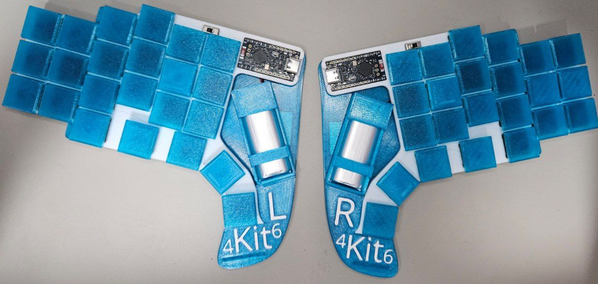

# Kit46

The Kit46 is a 3x6+5 split, BLE, handwired, keyboard powered by [ZMK firmware](https://github.com/zmkfirmware/zmk), tailored specifically for my hand size and preference. This is a follow up work from [HelloWorld8](https://github.com/angweekiat/zmk-config-helloworld8), a proof-of-concept 2x2 split keyboard project.

The casing, board, cover, keycaps are all 3d printed, and the circuit handwired. Both sides are powered by a battery each, and have a switch to turn the keyboard on and off.

The name originates from my shorten online alias and total number of keys available, `2x (3x6 + 5) = 46`.

## Features

### Magnets!

Magnets are inserted into the base of the keyboard on both sides.

__Probable Use Case #1__
You are walking around with your `Kit46` keyboard, and want to get a drink from the fridge. Rather than set your keyboard aside, you can make use of its magnets.

__Probable Use Case #2__
You are taking a break, when you receive a work notification and need to transition back to work. You retrieve your keyboard from under the table where it's magnetically attached.

### Misc

#### Power Switches
You feel cool turning on the keyboard in this manner.

#### Casing
Comes with protective casing for smooth travels.

#### Batteries
`Kit46` comes with a chonky 1000mAH 102050 Lithium battery on each siderrf t
zbe, enough to last for 3 months without charging for the left central keyboard, and 11 months for the right peripheral keyboard, according to [ZMK Power Profiler](https://zmk.dev/power-profiler).

Please bear in mind that the batteries were chosen solely based on the duration specified above, and upon delivery, their sizes were quite surprising to the keyboard creator.

### BLE (Bluetooth Low Energy) Support
This comes for free as part of using [ZMK firmware](https://github.com/zmkfirmware/zmk), not trying to claim credit for it, it's awesome that it works out of the box for me. I toggle the keyboard between 2 BLE profiles, one for my phone, one for work.

## Details

The keyboard switches are snap fitted into the board, and soldered directly to, each switch paired with a diode. While the microcontroller is housed together with the switches on the board, the batteries are stored separately in the base, due to the weight and size. In the image above, one can see several areas that are duct taped, my amateur skills are showing through.

The board and base are joined together via same sized indents located on both ends, the friction ensures that they are stuck together without some manual force prying them apart.

The cover went through 3 iterations to eventually use snap fit to securely hold the keyboard when travelling.

## Keymap

Layout created using https://jaroslaw-weber.github.io/keyfab/.

This definitely isn't the best layout out there, I left the numbers and function (F1-F12) keys in the same columns as a regular layout, and have redundant `TAB` and `ENTER` keys on my base layer. I use a range of programming languages at work, so there's no real symbol priorization on the symbol layers, outside of `-`, `_` and `=`, which are regularly used for command line usage.

Additionally, there are additional layers and details (BLE management, Home row mods, combos, macros) that are not displayed due to a lack of effort on my end, and also since they are more prone to changes since I'm still experimenting around.

## Bill of Materials

### Core purchases
Can't build a keyboard without any of these.
| Material | Cost (SGD) | Notes |
| -------- | ------- | ------- |
| NRF52840 Dev Board | 2x $8.18, from Shopee | Reused from my [HelloWorld8](https://github.com/angweekiat/zmk-config-helloworld8) project. |
| 3.7V 1000mAH 102050 Lithium Polymer | 1x $16.30, Pack of 2, Shopee | Decided 1000mAh based on [ZMK Power Profiler](https://zmk.dev/power-profiler), and the large battery size created constraints that served as a major factor for the final keyboard shape being pistol-shaped. |
| Switches | $73.81 | 2x Pack of 30 switches, [Kailh Shadow Series Low profile - Ghost](https://kailhswitch.net/products/kailh-lofree-customized-full-pom-shadow-series-low-profile-keyboard-switch-smooth-mechanical-keyboard-switch-hot-swap?srsltid=AfmBOor6CtgBn0iCRyP8Vt7W-vQp14H3CFcnqdpK0nZgFsFtvqF32VTE)
| Diodes | $4.06, Pack of 100 | |
| Wires | Free | Extracted copper wires from a spare HDMI cable. |
| Keycaps | Free-ish | 3D printed, see next section for filament cost. |
| __Section Total__ | __$110.53__ |

### [Cases / Base / Cover] related purchases
Can't nicely use the built keyboard without these.
| Material | Cost (SGD) | Notes |
| -------- | ------- | ------- |
| Magnets | 4x $5.30 Pack of 5 (20x10x10mm) magnets | Used to stick left side to the right side when stowing away. |
| Power Switch | $2.71, Pack of 5 ||
| Rubber stoppers | $3.38, Pack of 50 gains  | Used for keyboard base rubber feet. |
| Paper Clay | $6, Pack of 1kg | Used for text infill (See "This Side Down" text). |
| White Marker | $3 | Used for keyboard cover edges. |
| 3D print filament | 2x $15.40 | 'Transulent Blue' and 'White' colors, 1kg PETG, [ALT TAB Filament](https://alttabelectronics.com/collections/petg-filament). |
| 3D printer | - | Borrowed. |
| __Section Total__ | __$67.09__ |

### Misc purchases
| Material | Cost (SGD) | Notes |
| -------- | ------- | ------- |
| Soldering tools (Soldering iron, Stand, Solder, Flux, Desoldering Pump)| $50 | Brought a set from a friend. |
| Soldering Mat | $9 | From [Artfriend](https://artfriendonline.com/EN/OnlineUsers/Index) |
| Safety Googles | $7 | |
| Copper tape | $8.60, [5mm x 13m] roll  | Failed experiment, ended up not using it in the final product. |
| __Section Total__ | __$74.60__ | |

### Total cost: S$252.22

One of my motivations going into this project is to keep costs low, I didn't expect to spend such a huge sum by the end.

## Build Log

### Board

- TODO

### Casing

- TODO

### Cover

- TODO

## Typing Test

<iframe width="560" height="315" src="https://www.youtube.com/embed/HZgpkAom4NY?si=R_xkW9uB_RGsZHU5" title="YouTube video player" frameborder="0" allow="accelerometer; autoplay; clipboard-write; encrypted-media; gyroscope; picture-in-picture; web-share" referrerpolicy="strict-origin-when-cross-origin" allowfullscreen></iframe>

## Thoughts and Future work

TODO section:
- Notes
  - Looking into creating PCB designs for next keyboard
  - Want to add mouse controls in the form of a trackball
  - Want to add display so as to know which layer and BT profile I'm connected to